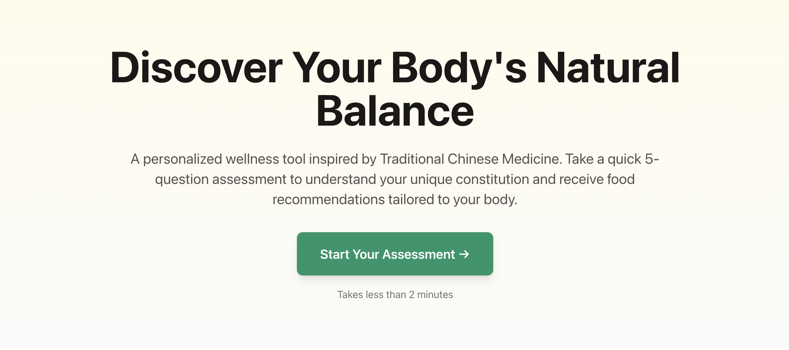
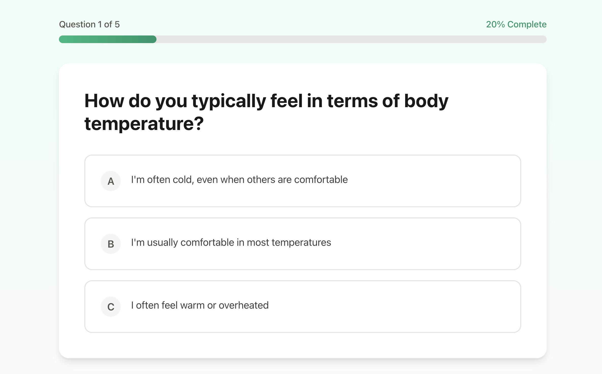
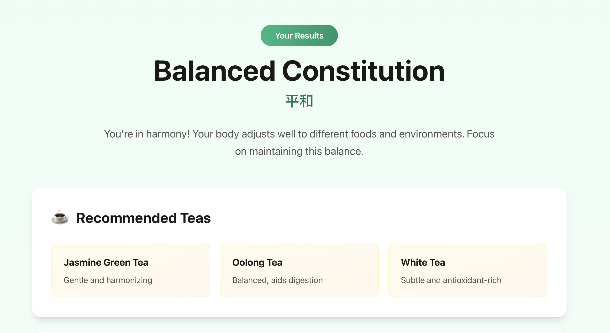

# MVP Description

Link to the website: https://endearing-truffle-d32667.netlify.app/

### Version
**v1.0.0 - Sprint 1 MVP Release**

## Features Included in This MVP

### 1. Interactive Constitution Assessment
- 5-question survey designed to identify user's TCM constitution type
- Questions cover key differentiating factors: temperature preferences, energy levels, digestion, sleep patterns, and food cravings
- Intuitive single-page question flow with progress tracking
- Back button navigation to review and change previous answers
- Real-time validation ensuring all questions are answered

### 2. Constitution Calculation Engine
- Algorithmic scoring system that maps answers to three constitution types: Cold, Heat, and Balanced
- Intelligent tie-breaking logic that defaults to "Balanced" when scores are equal
- Comprehensive calculation covering all question combinations
- Tested with 13+ unit test cases ensuring 100% accuracy

### 3. Personalized Results Display
- Clear identification of user's constitution type with English and Chinese names
- Accessible description of constitution characteristics in plain language
- Recommended herbal teas (3-4 per constitution) with specific health benefits
- Food recommendations organized by category:
  - Proteins (e.g., lamb, beef, chicken for Cold constitution)
  - Vegetables (e.g., root vegetables, warming spices)
  - Other beneficial foods
- Foods to avoid list with clear visual distinction
- Key principle statement summarizing dietary approach for the constitution type

### 4. Professional Landing Page
- Compelling hero section explaining the tool's value proposition
- Educational content about TCM constitution philosophy
- "How It Works" three-step process overview
- Trust-building section highlighting TCM principles and evidence-based approach
- Clear call-to-action buttons guiding users to assessment
- Medical disclaimer for responsible health information

### 5. Modern, Responsive UI
- Beautiful gradient color scheme (emerald greens, amber tones, stone grays)
- Card-based layout with clean visual hierarchy
- Fully responsive design working seamlessly on mobile, tablet, and desktop
- Smooth transitions and animations enhancing user experience
- Accessibility-focused design with clear typography and proper contrast

### 6. Complete User Journey
- Seamless flow: Landing Page → Assessment → Results → Return Home
- Option to retake assessment with one click
- Email subscription feature for future updates (UI only in MVP)

---

## Backlog Items Encompassed in This MVP

This MVP encompasses **all 9 Sprint 1 backlog items**:

| Item | Description | Status |
|------|-------------|--------|
| **Item 1** | TCM Constitution Translation & Simplification | Complete |
| **Item 2** | Constitution-to-Recommendations Mapping | Complete |
| **Item 3** | TCM Constitution Assessment Logic | Complete |
| **Item 4** | Landing Page Content | Complete |
| **Item 5** | Survey Frontend Implementation | Complete |
| **Item 6** | Results Display Component | Complete |
| **Item 7** | Basic Page Styling & Integration | Complete |
| **Item 8** | Deployment | Complete |
| **Item 9** | Testing & Documentation | Complete |

**Sprint 1 Velocity:** 25 story points  
**Completion Rate:** 100% (9/9 items)

---

## User Problem Being Solved

### The Pain Point

**Problem:** People interested in Traditional Chinese Medicine and holistic wellness face significant barriers to understanding and applying TCM principles to their daily lives:

1. **Complexity and Inaccessibility**
   - TCM constitution theory uses esoteric terminology (e.g., "Yang deficiency", "Phlegm-dampness") that is confusing to Western audiences
   - Authentic TCM consultations require finding qualified practitioners and investing significant time and money
   - Existing resources are either too simplified to be useful or too technical to be accessible

2. **Lack of Personalization**
   - Generic wellness advice doesn't account for individual body differences
   - One-size-fits-all dietary recommendations often conflict with what makes people feel good
   - Users don't understand why certain foods energize them while others cause discomfort

3. **Cultural and Language Barriers**
   - Most TCM resources are in Chinese or use translations that feel foreign
   - Recommended herbs and foods are often unavailable in Western markets
   - The philosophical framework feels disconnected from modern lifestyle

4. **Prevention Gap**
   - Western medicine focuses on treating symptoms after they appear
   - People lack tools for preventive self-care based on their body's unique needs
   - No accessible way to learn which foods support or undermine their natural balance

### Who Experiences This Problem

- **Wellness-conscious individuals** (ages 25-45) interested in holistic health but overwhelmed by TCM complexity
- **People with chronic digestive or energy issues** seeking root-cause approaches beyond Western medicine
- **Cultural explorers** curious about Traditional Chinese Medicine but lacking entry points
- **Health-conscious professionals** wanting personalized nutrition guidance based on their body's signals

---

## Value Proposition

### How This MVP is Better Than Current Alternatives

#### Compared to Traditional TCM Consultations:

| Aspect | Traditional TCM | Our MVP |
|--------|----------------|---------|
| **Cost** | $80-200 per consultation | Free |
| **Time** | 1-2 hours + travel | 2 minutes |
| **Accessibility** | Limited to major cities | Anywhere with internet |
| **Language** | Often requires translator | Plain English |
| **Immediacy** | Days/weeks to book appointment | Instant results |

#### Compared to Generic Wellness Apps:

| Feature | Generic Apps | Our MVP |
|---------|-------------|---------|
| **Personalization** | One-size-fits-all advice | Constitution-specific recommendations |
| **Cultural Foundation** | Western nutrition only | 2000+ years of TCM wisdom |
| **Prevention Focus** | Symptom tracking | Preventive balance maintenance |
| **Food Practicality** | Often exotic superfoods | Common US market items |

#### Compared to TCM Books/Websites:

| Aspect | Books/Websites | Our MVP |
|--------|---------------|---------|
| **Actionability** | Must self-diagnose from 9+ types | Automated 5-question assessment |
| **Accuracy** | Prone to self-misdiagnosis | Algorithm-based calculation |
| **User Experience** | Static text, overwhelming | Interactive, guided flow |
| **Updates** | Outdated information | Modern, maintained platform |

### Our Unique Value

1. **Bridges Cultural Gap**
   - Translates TCM concepts into modern wellness language without losing authenticity
   - Recommends teas and foods available at Whole Foods, Trader Joe's, and regular grocery stores
   - Respects TCM principles while speaking to Western mindset

2. **Empowers Preventive Self-Care**
   - Focuses on maintaining balance *before* symptoms arise
   - Provides actionable daily guidance (what tea to drink, what foods to emphasize)
   - Teaches users to tune into their body's signals

3. **Accessible and Immediate**
   - No appointment, no cost, no travel required
   - Results in 2 minutes with instant personalized guidance
   - Can retake seasonally as constitution may shift

4. **Evidence-Based Simplification**
   - Based on Wang Qi's validated 9-Constitution Framework (simplified to 3 core types for MVP)
   - Algorithmic assessment reduces human bias
   - Focused on most common constitutions for broader applicability

---

## Target User

### Primary User Persona: "Wellness-Seeking Sara"

**Demographics:**
- Age: 28-42 years old
- Location: Urban/suburban areas in the United States
- Education: College-educated, white-collar professional
- Income: Middle to upper-middle class

**Psychographics:**
- Values holistic health and preventive care
- Interested in cultural wellness traditions (yoga, Ayurveda, TCM)
- Reads wellness blogs, follows health influencers
- Shops at Whole Foods, Trader Joe's, or natural food stores
- Willing to try alternative approaches to health

**Behaviors:**
- Actively seeks personalized health recommendations
- Prefers natural solutions before pharmaceutical interventions
- Engages with wellness apps and online tools
- Values authenticity and evidence-based practices
- Shares health discoveries with friends and social media

**Pain Points:**
- Overwhelmed by conflicting nutrition advice
- Experiences unexplained fatigue, digestive issues, or temperature sensitivity
- Tried generic wellness advice without seeing results
- Curious about TCM but intimidated by complexity
- Wants to understand *why* certain foods make them feel better or worse

**Goals:**
- Understand their body's unique needs
- Receive actionable, personalized dietary guidance
- Learn preventive self-care practices
- Feel empowered to make informed wellness choices
- Connect daily habits to long-term health

### Secondary User Personas

**"Curious Chris" (Cultural Explorer)**
- Age 25-35, tech-savvy, enjoys trying new things
- Interested in TCM from cultural curiosity rather than health issues
- Values learning and self-discovery experiences

**"Chronic Condition Carla" (Health Seeker)**
- Age 35-55, has tried multiple Western medical solutions without relief
- Experiences chronic digestive issues, energy fluctuations, or temperature sensitivity
- Actively researching alternative and complementary medicine approaches

---

## Product Owner's Vision

**Long-term Vision:** Create an AI-powered platform that democratizes Traditional Chinese Medicine knowledge, making personalized preventive health guidance accessible to everyone while honoring TCM's cultural roots and evidence-based principles.

**Near-term Focus (Sprint 1-2):** Build a foundation of accurate, well-sourced TCM content by translating high-quality Chinese TCM materials into English with proper references. Establish credibility through evidence-based content before expanding into interactive features.

**Key Priorities:**
1. **Content Quality Over Speed:** Focus on translating and documenting authentic TCM materials from reputable Chinese sources with proper citations
2. **Granular, Specific Backlog:** Break down large features into small, manageable tasks with clear acceptance criteria
3. **Practical Scrum Implementation:** Demonstrate effective use of scrum board, daily standups, and sprint planning to bring tangible value to users
4. **User Value First:** Each feature must clearly address user needs and pain points

**Sprint 1 Adjustment:** 
- Original plan included a 5-question survey, but time constraints required pivoting to build foundational trivia features first
- Survey functionality moved to Sprint 2 to allow proper development time
- Sprint 1 focus shifted to establishing core TCM content and references that will support future interactive features

**Project Scope Refinement:**
- Current backlog is too broad and generic
- Future sprints will include more specific, smaller tasks
- Example of well-defined backlog item: "Translate specific TCM material from Chinese source X to English, include source references, and validate accuracy"

**Sprint Cadence:**
- Project deadline: Sunday
- Team conducts 3 daily standups per sprint to maintain alignment and momentum

---

## Success Metrics for This MVP

### Quantitative Metrics
- User completion rate (% who finish assessment after starting)
- Retake rate (% who take assessment multiple times)
- Session duration (time spent engaging with results)
- Mobile vs desktop usage distribution

### Qualitative Metrics
- User feedback on recommendation relevance
- Clarity of constitution descriptions
- Ease of navigation through assessment
- Visual design and user experience satisfaction

### Business Validation Metrics
- Total users reached in first 30 days
- Email subscription conversion rate
- Social sharing/referral indicators
- User testimonials and feedback quality

---

## Conclusion

This MVP successfully delivers a **minimum viable but complete solution** that:
- Solves real user pain points around TCM accessibility
- Provides clear value superior to existing alternatives
- Serves the target wellness-conscious audience effectively
- Aligns perfectly with Product Owner's long-term vision
- Establishes technical and cultural foundation for future AI-powered features

**Next Release Focus:** Expand constitution types, add AI personalization, integrate community features.

---

**Version:** 1.0.0  
**Release Date:** October 26, 2025  
**Sprint:** Sprint 1 (October 16-26, 2025)  
**Team:** Huiqin & Shufan
